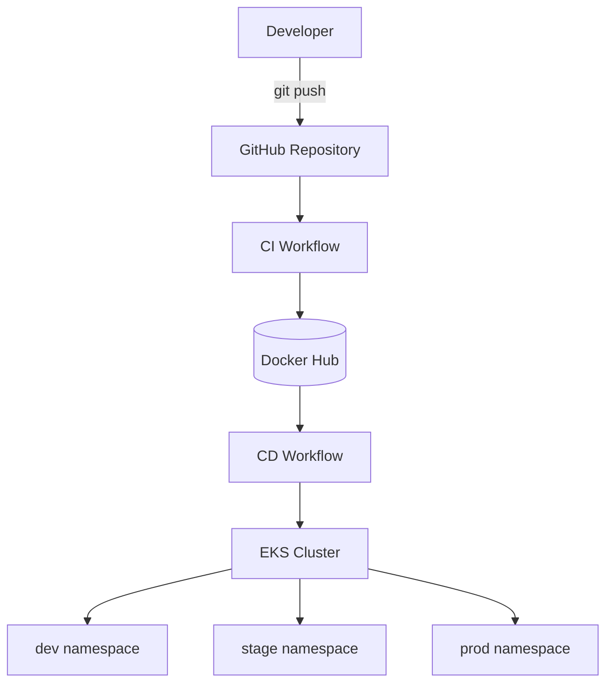
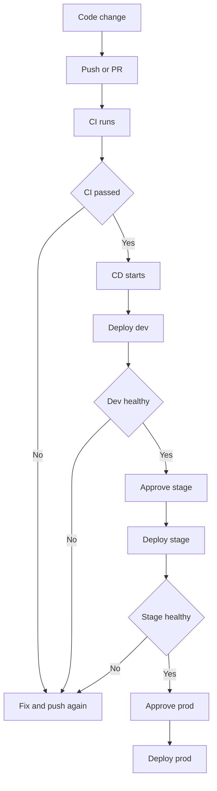
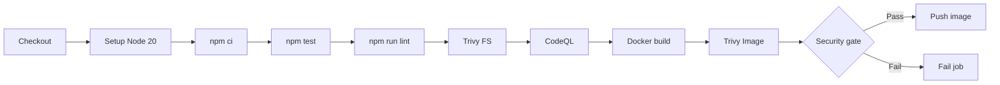
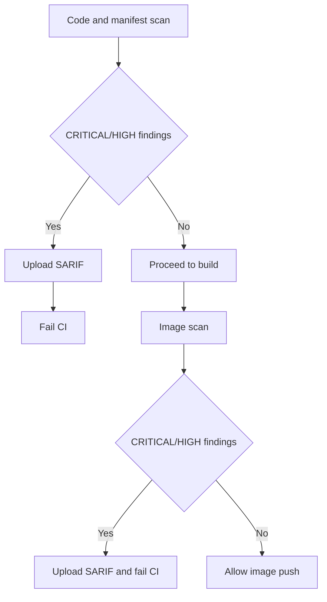
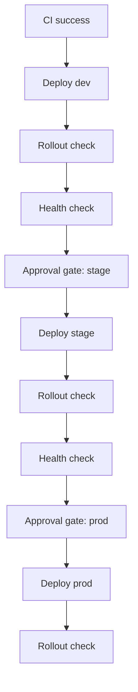
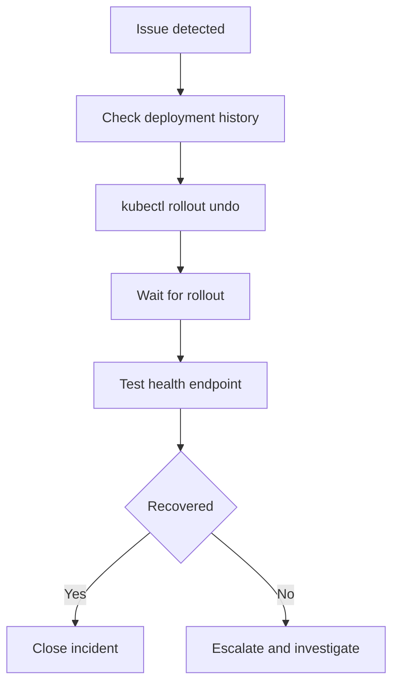
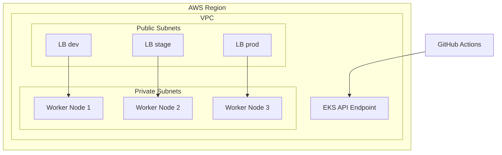

# CI/CD Pipeline Architecture

This document provides architecture and workflow diagrams for the GitHub Actions and AWS EKS based deployment pipeline.

## Table of Contents

1. Overall Architecture
2. Developer Flow
3. CI Pipeline
4. Security Scan Flow
5. CD Deployment Flow
6. Rollback Flow
7. EKS Cluster Architecture

---

## 1. Overall Architecture



### Components

| Component | Purpose |
|---|---|
| GitHub Repository | Source code, manifests, workflows |
| CI Workflow | Test, lint, scan, build, push image |
| Docker Hub | Container image registry |
| CD Workflow | Deploy image to EKS namespaces |
| EKS Cluster | Hosts all environments |

---

## 2. Developer Flow



---

## 3. CI Pipeline



### Gate Rules

- Trivy filesystem scan: fail threshold is CRITICAL/HIGH
- Trivy image scan: fail threshold is CRITICAL/HIGH
- SARIF upload still runs even when scans fail

---

## 4. Security Scan Flow



---

## 5. CD Deployment Flow



### Deployment Behaviors

| Path | Behavior |
|---|---|
| Automatic path | `dev -> stage -> prod` with approvals on stage/prod |
| Manual path | Deploy only selected environment (`dev`, `stage`, or `prod`) |
| Auth mode | `oidc` or `keys` |

---

## 6. Rollback Flow



Rollback commands:

```bash
kubectl rollout history deployment/demo-app -n prod
kubectl rollout undo deployment/demo-app -n prod
kubectl rollout status deployment/demo-app -n prod
```

---

## 7. EKS Cluster Architecture



### Environment Profile

| Environment | Replicas | Approval required |
|---|---|---|
| dev | 1 | No |
| stage | 2 | Yes |
| prod | 3 | Yes |

---

## References

- GitHub Actions docs: https://docs.github.com/en/actions
- Amazon EKS docs: https://docs.aws.amazon.com/eks/
- Trivy docs: https://aquasecurity.github.io/trivy/
- CodeQL docs: https://codeql.github.com/docs/
